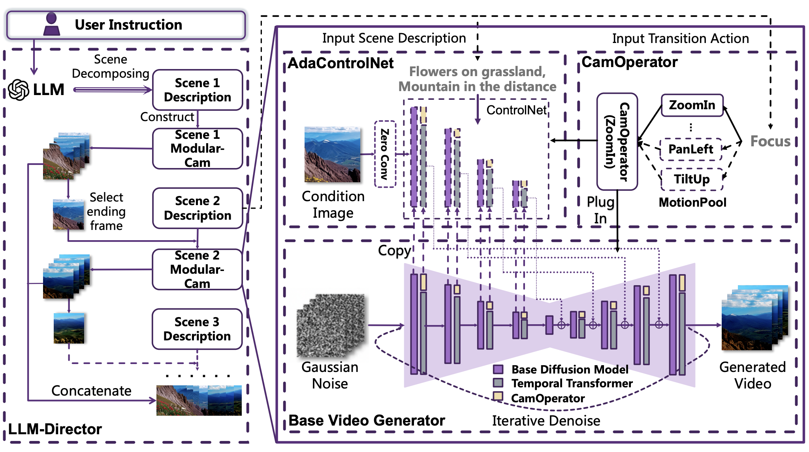
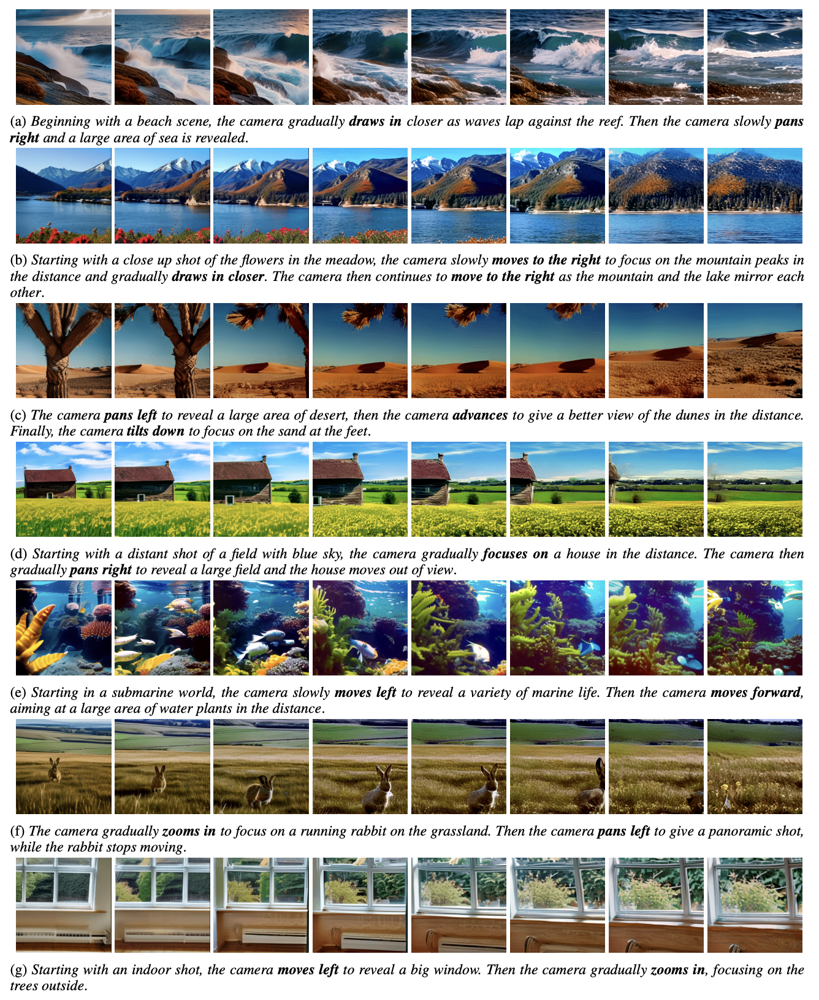

# Modular-Cam: Modular Dynamic Camera-view Video Generation with LLM
> [Modular-Cam: Modular Dynamic Camera-view Video Generation with LLM](https://arxiv.org/pdf/2504.12048)
> 
> Zirui Pan, Xin Wang, Yipeng Zhang, Hong Chen, Kwan Man Cheng, Yaofei Wu, Wenwu Zhu
> 
> Text-to-Video generation, which utilizes the provided text prompt to generate high-quality videos, has drawn increasing attention and achieved great success due to the development of diffusion models recently. Existing methods mainly rely on a pre-trained text encoder to capture the semantic information and perform cross attention with the encoded text prompt to guide the generation of video. However, when it comes to complex prompts that contain dynamic scenes and multiple camera-view transformations, these methods can not decompose the overall information into separate scenes, as well as fail to smoothly change scenes based on the corresponding camera-views. To solve these problems, we propose a novel method, i.e., Modular-Cam. Specifically, to better understand a given complex prompt, we utilize a large language model to analyze user instructions and decouple them into multiple scenes together with transition actions. To generate a video containing dynamic scenes that match the given camera-views, we incorporate the widely-used temporal transformer into the diffusion model to ensure continuity within a single scene and propose CamOperator, a modular network based module that well controls the camera movements. Moreover, we propose AdaControlNet, which utilizes ControlNet to ensure consistency across scenes and adaptively adjusts the color tone of the generated video. Extensive qualitative and quantitative experiments prove our proposed Modular-Cam's strong capability of generating multi-scene videos together with its ability to achieve fine-grained control of camera movements. Generated results are available at https://modular-cam.github.io.

## Overview
This is the official implementation of AAAI 2025 paper *Modular-Cam: Modular Dynamic Camera-view Video Generation with LLM*. The model weights can be downloaded from [HuggingFace](https://huggingface.co/pzrain/modular-cam). For animated video results, please refer to the [project page](https://modular-cam.github.io/).

## Framework

Framework for our proposed Modular-Cam, which contains four modules, i.e., Base Video Generator, CamOperator, AdaControlNet, and LLM-Director. First, the LLM is utilized to parse the user instruction, decomposing it into multiple scenes with descriptions. Then for each scene, a video generator is built, which has been integrated with CamOperator and AdaControlNet. LLM will identify the camera-view transformation in each scene and select from the MotionPool to plug in the appropriate CamOperator Module, which will enable the output video to follow the specific motion pattern, i.e., ZoomIn. A condition image, that is the ending frame of the last scene, is inputted into the AdaControlNet, which will guide the generation of the current scene. Finally, the video clips for each scene are concatenated orderly to form the final multi-scene dynamic camera-view video.

## Generated Results


## Installation
```bash
git clone git@github.com:pzrain/Modular-Cam.git
cd Modular-Cam
pip install -r requirements.txt
```
Please download `mm_sd_v15_v2.ckpt` into `models/Motion_Module/mm_sd_v15_v2.ckpt` and the `v2_lora_*.ckpt` into  `models/MotionLoRA/`, from [HuggingFace](https://huggingface.co/guoyww/animatediff) of AnimateDiff. Please download the stable-diffusion-v1-5 weights from their official website into `models/StableDiffusion`. And please download the pretrained weights for Modular-Cam from [HuggingFace](https://huggingface.co/pzrain/modular-cam) into `models/model.ckpt`

## Inference
We adopt chatgpt as the backbone LLM model, so you need to input your api key into `SECRET_KEY` in `scripts/openai_api.py`. For inference, run the following command:
```bash
python -m scripts.run --prompt "Beginning with a beach scene, the camera gradually draws in closer as waves lap against the reef. Then the camera slowly pans right and a large area of sea is revealed"
```
You will find the generated result in `prompts/final.gif`.

## Acknowledgements
Codebase built upon [AnimateDiff](https://github.com/guoyww/AnimateDiff).

## Citation
If you find our work useful, please kindly cite our work:
```bash
@inproceedings{pan2025modular,
  title={Modular-Cam: Modular Dynamic Camera-view Video Generation with LLM},
  author={Pan, Zirui and Wang, Xin and Zhang, Yipeng and Chen, Hong and Cheng, Kwan Man and Wu, Yaofei and Zhu, Wenwu},
  booktitle={Proceedings of the AAAI Conference on Artificial Intelligence},
  volume={39},
  number={6},
  pages={6363--6371},
  year={2025}
}
```